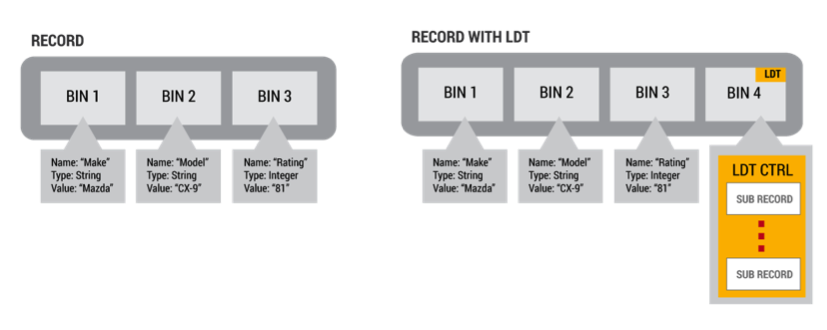

# Using a Large List as a Stack, Map or Queue
*Author: Peter Milne, Aerospike Director of Applications Engineering*

Scenario 1: You need a stack of events, like a browser history, that is very large. These events are specific to a unique user/deviceID/cookie/etc. It’s a stack (LIFO) because the most interesting, or valuable, events are the most recent and are on the top of the stack.

Scenario 2: You need a queue of events, that is very large, for a unique user/deviceID/cookie/etc. You want to add things to the queue are read from it atomically (FIFO).

Scenario 3: You need a set of events stored with a time stamp, for a unique user/deviceID/cookie/etc, and you want to keep a very large number of them. 

In this post, I’ll discuss how to use Aerospike’s Large List (LList) to implement a stack and queue of unlimited size.

## Large Data Types
A Large Data Type (LDT) is a collection where each element is a sub record. Sub-records are very similar to regular Aerospike records, with the main exception that they are linked to a parent record. They share the same partition address and internal record lock as the parent record, so they move with their parent record during migrations and they are protected under the same isolation mechanism as their parent record. Thus, LDT objects take advantage of Aerospike’s robust replication, re-balancing and migration mechanisms that ensure immediate consistency and high availability.



With this design the collection can contain literally billions of elements. The main or top records contain a control Bin that configures and manages the LDT

## Large List
The most versatile of LDTs is the Large Ordered List, or LList for short.  LList is large sorted map by nature, and it is optimized for searching and updating sorted lists. It can access data at any point in the collection via the key, while still being capable of growing the collection to virtually any size.

The Large List is particularly suited for storing any type of ordered data, either simple values (numbers, string) or complex objects (lists, maps, documents). If the object being stored does not implicitly have an atomic value that can be compared (and thus ordered). 

One of the really neat features of a LList is enabled when the element to be store is a Map. If the map has a key named “key”, the LList is ordered by the the value referenced by “key”. If the key is a numeric index, you can reference the elements by number.  If the key is set as a timestamp it becomes time series collection.


### LList Features:
- Atomic or Complex object management
- Infinite Storage
- UDF Predicate Filters
- Single-item or multi-item insert
- Single-value search, with optional UDF filter
- Range value search, with optional UDF filter
- Full scan, with optional UDF filter
- Single-item Update
- Min and Max search
- Single-Value Delete

## Example code
Code examples for implementing the following  collections can be found at:
https://github.com/helipilot50/aerospike-LDT-techniques.git

Clone the repository with:
```bash
git clone https://github.com/helipilot50/aerospike-LDT-techniques.git
```
### How to build
These examples requires a working Java development environment (Java 6 and above) including Maven (Maven 2). The Aerospike Java client will be downloaded from Maven Central as part of the build.
After cloning the repository, use maven to build the jar files. From the root directory of the project, issue the following command:
```bash
mvn clean package
```
A JAR file will be produced in the directory `target`: `aerospike-ltd-techniques-1.0.0-full.jar`
### How to run
These examples are deliberately designed as a library of 3 reusable classes:
- LDTMap - This class implements the Java Map interface
- LDTQueue - This class implements the Java Queue interface
- LDTStack - This class subclasses the Java Stack class

No main() method is supplied, instead 3 JUnit test cases and 1 JUnit test suite are used to test and illustrate the usage of these classes.
The test suite AllTests will run as when you issue the Maven command above.
While the classes are packaged as a library, their code is deliberately independent of each other to enable the use of a class without dependencies and to verbosely illustrate the code without the complexity of inheritance or aggregation.

## Using a Large List as a Map
Using a LList as a Map is dead easy, essentially because it is a large sorted map. Most of the work in the LDTMap class is make the LList functionality plug compatible with the Java Map interface, by wrapping the llist API.

Let’s examine implementation of the `get()` method, and all it's supporting code.

First we will look at the `getList()` method: 
```java
	private LargeList getList(){
		if (llist == null)
			llist = this.client.getLargeList(null, key, binName, null);
		return llist;
	}
```
You can see that this is a lazy resolution of the field `llist` using the Aerospike client API `getLargeList()`.

Whenever you access an element in a LDT via the key, you specify a map that contains the key value (yep it's a bit weird, but thats how it works). Here is an example expressed in JSON:
```json
{"key": 26745}
``` 
In this example, we are looking for an element in the Map who's key is equal to 26745. To make this easier we have provided a method to do this in `makeKeyMap()`
```java
	private Map<String, Object> makeKeyMap(Object key){
		Map<String, Object> map = new HashMap<String, Object>();
		map.put(LDT_KEY, key);
		return map;
	}
```

Now we will examine implementation of the `get()` method, consider the following code:

```java
	@SuppressWarnings("unchecked")
	@Override
	public V get(Object key) {
		List<Map<String, Object>> list = 
			(List<Map<String, Object>>) getList().find(Value.getAsMap(makeKeyMap(key)));
		Object element = null;
		if (list != null && list.size() > 0)
			element = ((Map<String, ?>)list.get(0)).get(LDT_VALUE);
		return (V) element;
	}
``` 
You can see that we make a `Map` and a `Value` from the key passed into the `get()` method, and we invoke the `find()` method on the LDT reference.  The `find()` method returns a List of elements that match the key (you can configure a llist to contain duplicate keys). To comply with the `Map` interface we only return the first element.

**NOTE:**The implementation is complete with one exception, the  `containsValue()` method is not implemented. While this method is technically possible, scanning through potentially billions of entries to see if a value is there is not efficient. If you need this kind of functionality, consider indexing the data using an additional structure.


## Using a Large List as a Stack
A stack is a Last In First Out (LIFO) data structure. Essentially a stack needs a  counter as key, in increases on push and decreases on pop. Aerospike has support for counters by using an Integer Bin. When the stack has no elements the counter is zero. 

On a push operation, the counter is incremented and the value of the counter becomes the key for the new element.

On a pop operation, the element is removed from the llist using the current value of the counter, the counter is decremented, and the value is returned to the client application.

For this to work, the counter operations and the llist operations need to be atomic, this is best done using a User Defined Function ([UDF](http://www.aerospike.com/docs/udf/udf_guide.html)). Located in the `udf` subdirectory is the UDF module: `stack.lua`. Each function represents a stack operation callable from the client. The counter is maintained in the Bin "ldt-top". This UDF module must be registered with the cluster before is available for use. 

The Java class `LDTStack` subclasses the Java Stack class, and overrides the methods to provide a new implementation using an llist. Each method calls a UDF using the Aerospike client API. 


As and example, let's consider how `push()` is implemented.

This is the `push()` method in Java
```java
	@Override
	public synchronized E push(E item) {
		client.execute(null, this.key, 
				STACK_MODULE, "push", 
				Value.get(this.binName), Value.get(item));
		return item;
	}
```
As you can see, the `execute()` method is passed the record key, module name and function, bin name and the item to be pushed onto the stack. All the hard work of the `push` operation is done in the UDF.

Here is the UDF that implements the `push` operation.
```lua
function push(rec, bin, item)
  local top = next(rec, LDT_TOP)
  local value = makeMap(top, item)
  llist.add(rec, bin, value)
end
```
In the first line, a function `next(...)` is called to increment the counter in the `ldt-top` Bin. Then a single element `map` is constructed using the value of `top` as the key and `item` as the value. Finally the `add` function is called on the llist to add the new value. 

Because the new value is the largest number, it is the top of the stack. The counter and llist are updated atomically.

The `pop` operation is the inverse of `push`. 


## Using a Large List as a Queue
A Queue is a First In First Out data structure (FIFO). A Queue also can be implemented on similar lines to a stack, the difference being that you need a counter for the head of the queue and also one for the tail of the queue.
The counters need to be updated atomically with the operations, so a UDF is the way to do this.

When an element is added to the tail of the queue the `tail` counter is incremented. When an element is removed from the head of the queue the `head` counter is incremented. When the `head` counter is greater than the `tail` counter, the queue is empty and both counters can be reset to zero.

Located in the `udf` subdirectory is the UDF module: `queue.lua`. Each function represents a queue operation callable from the client. The tail counter is maintained in the Bin "ldt-tail" and the head counter is maintained in the Bin "ldt-top". This UDF module must be registered with the cluster before is available for use. 

The Java class LDTQueue implements the Java Queue interface, and implements the methods using an llist. Each method calls a UDF using the Aerospike client API.


Let's consider how `add()` is implemented.

This is the `add()` method in Java.
```java
	@Override
	public boolean add(E e) {
		client.execute(null, this.key, 
		QUEUE_MODULE, "add", 
		Value.get(this.binName), Value.get(e));
		return true;
	}
```
Similar to our previous example, you can see, the `execute()` method is passed the record key, module name and function, bin name and the item to be added onto the queue. All the hard work of the `add` operation is done in the UDF.

Here is the UDF that implements the `add` operation.
```lua
function add(rec, bin, item)
  local top = rec[LDT_TOP] or 0
  if top == 0 then
    next(rec, LDT_TOP)
  end
  local tail = next(rec, LDT_TAIL)
  local value = makeMap(tail, item)
  llist.add(rec, bin, value)
end
```
In the first line we get the head of the queue, in increment it if it is zero. then we get the next tail and add the element to the llist using a single element `map` constructed with the value of `top` as the key and `item` as the value. 

Naturally, the `remove` operation uses the head of the queue and is almost the inverse of `add`.

# Conclusion
Aerospike Large Ordered Lists are very versatile and with a little bought can be applied to implement many collections. The collections can be huge with billions of elements, they are atomic and perform at Aerospike scale, speed and reliability.


